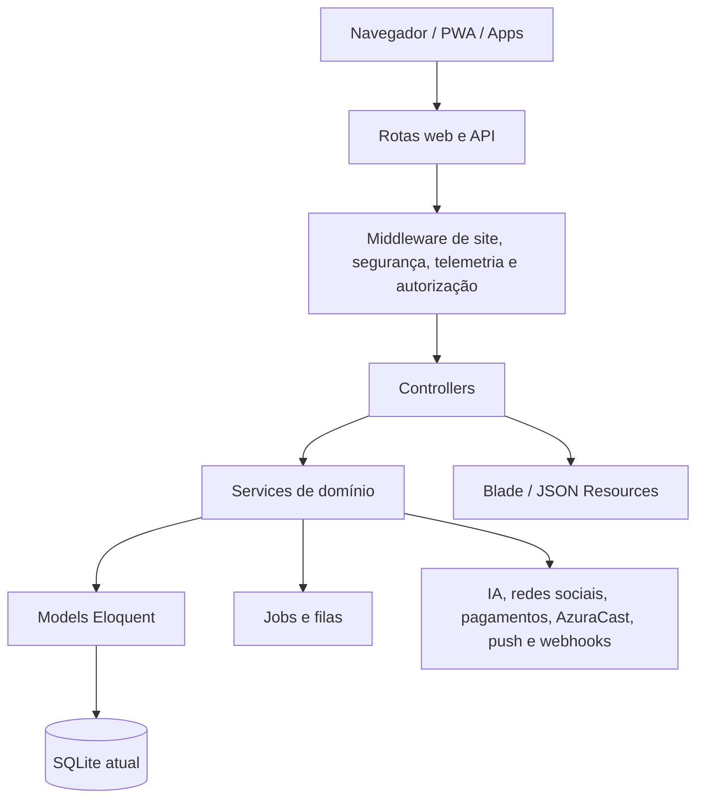

# Arquitetura

## Visão lógica

## Camadas

### HTTP

Há 104 controllers e 10 middlewares. O bootstrap registra resolução de site, validação de upload, rate limit administrativo, auditoria de mutações, cabeçalhos de segurança e telemetria.

### Domínio

Os 97 models representam conteúdo, redação, rádio, TV, comercial, assinaturas, analytics, multisite e integrações.

### Serviços

Os 52 services encapsulam operações complexas. Exemplos:

- `AI/AiAgentWorkflowService.php`
- `AI/AiAuditService.php`
- `AI/AiCostCalculator.php`
- `AI/AiEditorialManager.php`
- `AI/AiEditorialMemoryService.php`
- `AI/AiEditorialMetricsService.php`
- `AI/AiNewsGenerator.php`
- `AI/AiPromptVersionService.php`
- `AI/AiProviderHealthService.php`
- `AI/AiProviderQuotaService.php`
- `AgencyApprovalService.php`
- `AiWritingAssistant.php`
- `AudioAdvertisingService.php`
- `AzuraCast/AzuraCastClient.php`
- `AzuraCast/AzuraCastRadioProvider.php`
- `BackupService.php`
- `Cache/HomeCache.php`
- `Cache/PublicContentCache.php`
- `CommercialFinanceService.php`
- `Database/DatabaseHealthService.php`
- `EditorialCalendarService.php`
- `EditorialFactCheckService.php`
- `EditorialSourceResearchService.php`
- `Media/PublicImageUploadService.php`
- `MercadoPagoService.php`
- `NewsDistributionService.php`
- `NewsEditorialWorkflowService.php`
- `NewsNarrationService.php`
- `ObservabilityService.php`
- `PaywallService.php`
- `PrintEditionPdfService.php`
- `Push/FirebaseCloudMessaging.php`
- `RadioDashboardService.php`
- `RadioOnAirService.php`
- `RadioPlaybackService.php`
- `RssImportService.php`
- `RssPrePitchService.php`
- `RssSimilarityService.php`
- `RssTrendService.php`
- `Search/UnifiedSearchService.php`
- `Security/EmbedCodeSanitizer.php`
- `Security/PublicUrlGuard.php`
- `SimplePdfService.php`
- `SiteStorage.php`
- `SubscriptionBenefitService.php`
- `SubscriptionService.php`
- `TvBroadcastService.php`
- `TvDashboardService.php`
- `VideoClipRenderer.php`
- `VideoPlayerService.php`
- `VideoScriptGenerator.php`
- `WebhookDispatcher.php`

### Processamento assíncrono

Jobs identificados:

- `CollectRssFeedJob`
- `DeliverWebhookJob`
- `GenerateNewsNarrationJob`
- `ImportRssFeedsJob`
- `RenderVideoClipJob`

### Comandos operacionais

- `AnalyzeRssTrends.php`
- `AuditDatabaseCommand.php`
- `CollectDueRssFeeds.php`
- `CreateBackup.php`
- `DeployCheck.php`
- `LoadTest.php`
- `PruneBackups.php`
- `PurgeExpiredAnalytics.php`
- `SmokeTest.php`
- `VerifyBackup.php`

## Multisite

`ResolveCurrentSite` determina o site corrente nas requisições web e API. Models com isolamento usam o escopo/concern correspondente. Alterações em consultas globais devem ser revisadas para evitar vazamento entre sites.

## Persistência

O projeto é orientado por migrations e atualmente usa SQLite. O código deve continuar evitando SQL específico de um único banco enquanto a estratégia futura de MySQL não for aprovada.
