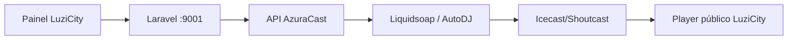

# Rádio e integração AzuraCast

## Domínio local

O LuziCity mantém seu próprio domínio editorial e comercial de rádio:

- `RadioStation`
- `RadioProgram`
- `RadioHost`
- `RadioScheduleSlot`
- `RadioRequest`
- `PodcastSeries` e `PodcastEpisode`
- `NewsNarration`
- `AudioCampaign`, `AudioSpot` e `AudioAdPlay`

## Integração AzuraCast

O checkpoint inclui:

- `AzuraCastController`
- `AzuraCastClient`
- `AzuraCastRadioProvider`
- `routes/azuracast.php`
- teste `AzuraCastNativeIntegrationTest`
- documentação de auditoria e plano de implantação

A arquitetura correta mantém o AzuraCast em Docker e o Laravel fora do Docker neste estágio. O painel do LuziCity usa a API do AzuraCast pelo backend; o token nunca deve chegar ao navegador.

## Configuração

Use `AZURACAST_ENABLED`, `AZURACAST_BASE_URL`, `AZURACAST_API_KEY`, `AZURACAST_STATION_ID`, `AZURACAST_STATION_SHORTCODE`, timeout, SSL e cache.

## Regras

- Sem iframe como solução principal.
- Sem compartilhamento de banco entre Laravel e AzuraCast.
- Fallback para a URL de stream configurada localmente.
- Erros do AzuraCast não podem derrubar o painel.
- Comandos start/stop/restart exigem autorização, CSRF, rate limit e auditoria.
- A API key deve ser mascarada e nunca registrada em logs.
