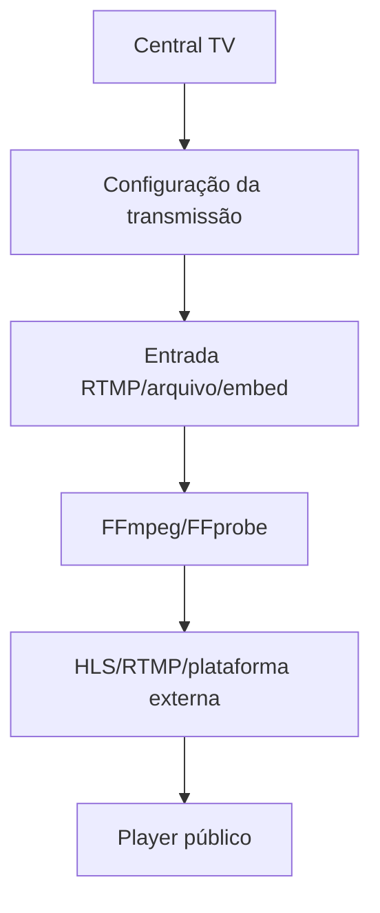

# TV web e vídeo

## Componentes

- `TvChannel` e `TvBroadcast` para canais e transmissões.
- `Video`, `VideoCategory`, `VideoSeries` e `VideoPlaylist` para videoteca.
- `VideoScript` para roteiros assistidos.
- `VideoClip` para recortes e formatos curtos.
- `TvBroadcastService`, `TvDashboardService`, `VideoPlayerService`, `VideoScriptGenerator` e `VideoClipRenderer`.
- Jobs de renderização para tarefas demoradas.

## Fluxo

## Limite do AzuraCast

AzuraCast é motor de rádio/áudio. Ele não deve ser tratado como servidor de TV. A central de TV deve usar FFmpeg e um servidor RTMP/HLS dedicado quando houver transmissão própria.

## Segurança operacional

- Não concatenar entradas do usuário em comandos shell.
- Usar argumentos separados e allowlists.
- Mascarar chaves RTMP.
- Evitar dois encoders para a mesma transmissão.
- Registrar logs sanitizados e status do processo.
- Usar worker/supervisor em produção.
