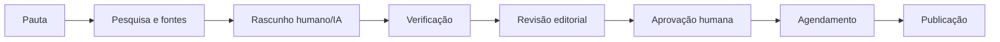

# IA editorial e sala de redação

## Central Editorial IA

A plataforma possui models e services para:

- provedores e limites;
- execuções e métricas;
- prompts e versões;
- memória editorial, regras e termos;
- custos e auditoria;
- geração de notícias;
- agentes e passos de workflow.

## Fluxo editorial

## Regras fundamentais

- IA não publica automaticamente.
- Todo conteúdo factual exige revisão e fontes adequadas.
- Prompts são versionados.
- Termos e regras editoriais são aplicados como contexto e alertas.
- Chaves de provedores não aparecem em HTML ou logs.
- Custos usam valores decimais e podem permanecer nulos quando não configurados.
- Testes de conexão e prompt não criam notícia publicada.
