# Luzicity - Mapa Diagramado

Atualizado em: 09/07/2026

Este arquivo usa diagramas Mermaid. Em editores compativeis, os blocos aparecem como graficos.

## 1. Mapa Geral da Plataforma

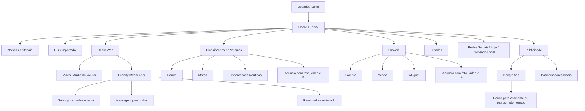

## 2. Fluxo de Login e Papeis

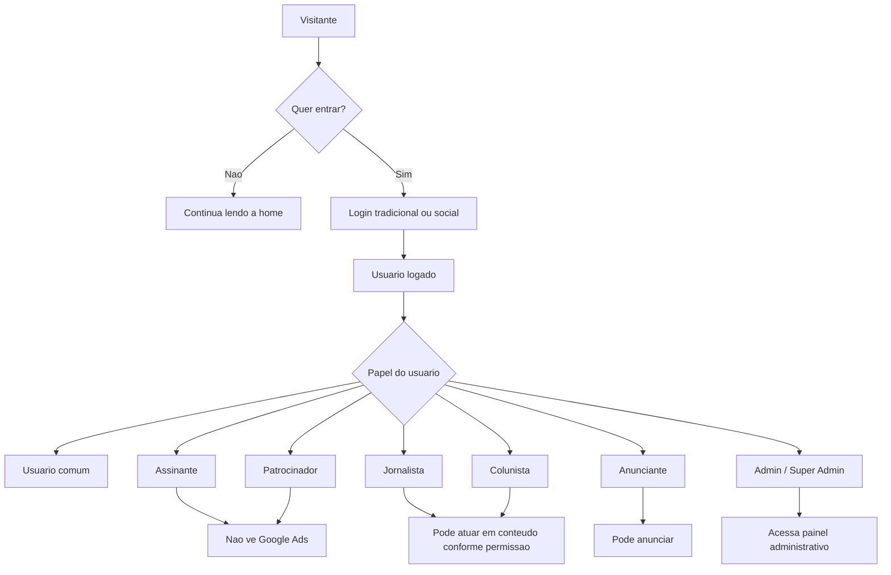

## 3. Mapa do Backend

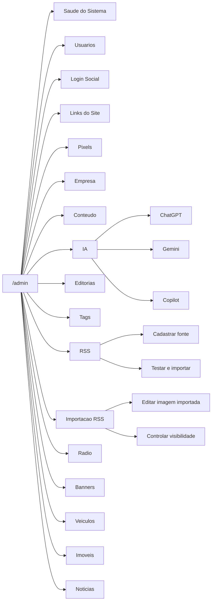

## 4. Fluxo RSS

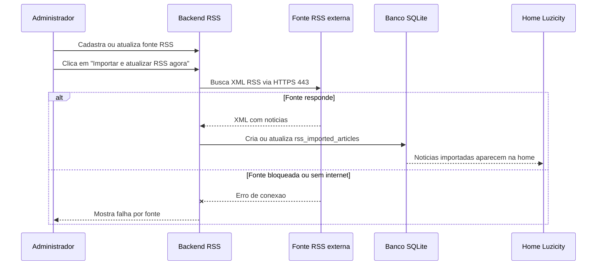

## 5. Fluxo de Criacao de Noticias com IA

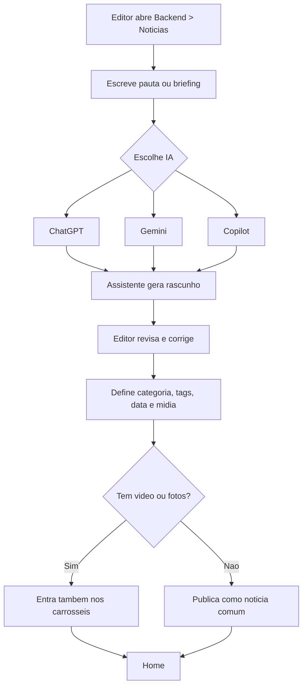

## 6. Fluxo da Radio e Bate-Papo

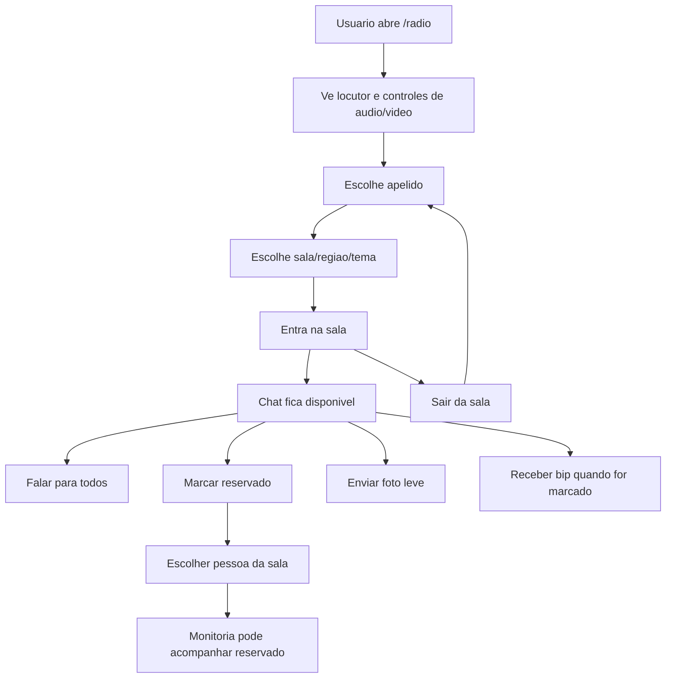

## 7. Fluxo dos Classificados de Veiculos

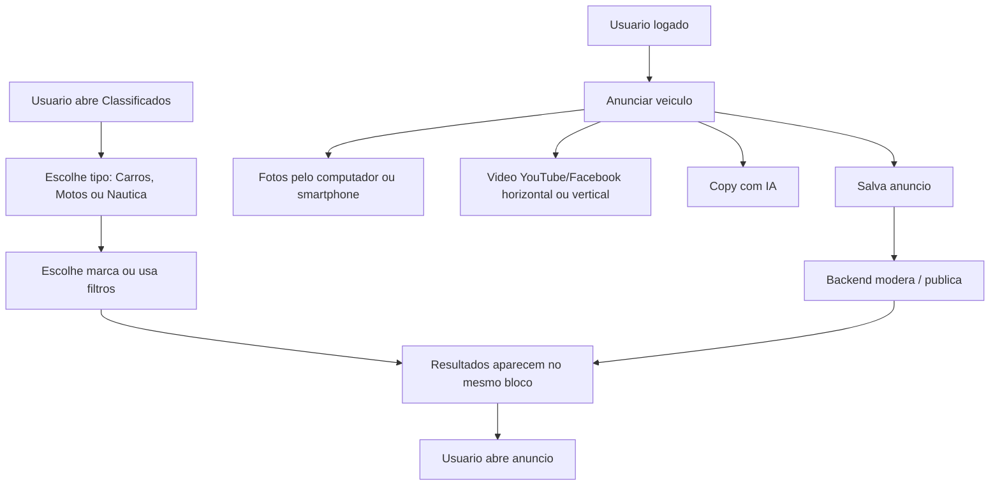

## 8. Fluxo dos Imoveis

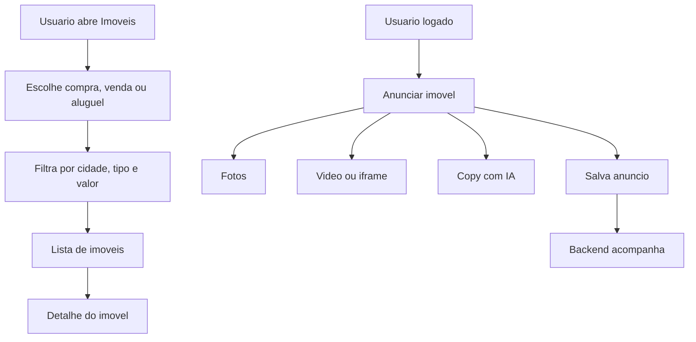

## 9. Mapa de Banco de Dados

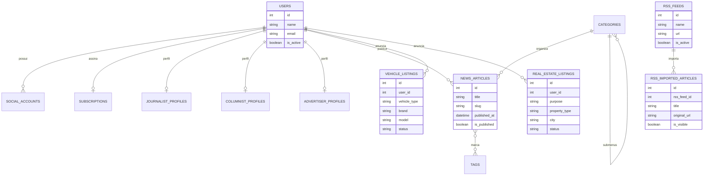

## 10. Mapa de Pastas

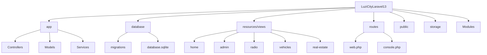

## 11. Roadmap Recomendado

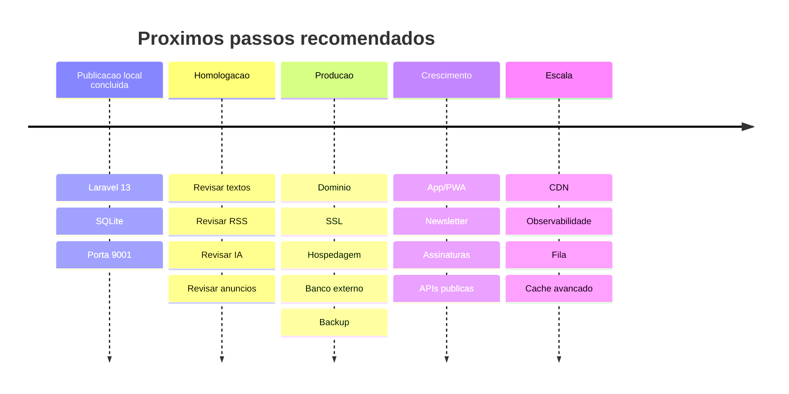
